# Brilliant Blackjack

Brilliant Blackjack is a python terminal game, which runs in a mock terminal through Heroku.

Users will play against the computer to get blackjack or as close to it as they dare. Each round will add to a total score bewtween player and computer. The aim of the game is to beat the computer.

## Live Website

[Brilliant Blackjack](https://brilliant-blackjack-94e6e2e8e263.herokuapp.com/)

## Repository

[Repository Link](https://github.com/Daniel009891/brilliant-blackjack)

## UX: User Experience

### User Stories

As a user,

* I would like the game to be fun.
* I would like to be able to navigate easily through the game.
* I would like to compete against a computer.
* I would like to be able to recieve feedback on scores and cards dealt.

### Initial Concept

The initial concept was to create a fun terminal based game of blackjack, which enables users to compete against the computer, to see their scores for their hand and see the total scores of games won. 

## Features

* Interaction - Players can interact with the game by choosing to stick with their initial cards or twist to receive a new card from the deck. this is done by the use of functions which randomly select a new card from the deck and append it into the users cards. 

* Computer AI - The computer will make decisions on whether to stick or twist by using logic. The computers decision is cretaed by a function that specifies a random range between 16 and 19 which is based off the score that the computer initially has. 

* Scores - The game displays the initial scores for both the player and the computer, this is updated when the player or computer twists and recieves a new card. The scores are set to bust at > 21 within the twist functions. The total wins are also displayed and incremented after every round.

### Existing Features

#### Landing Page

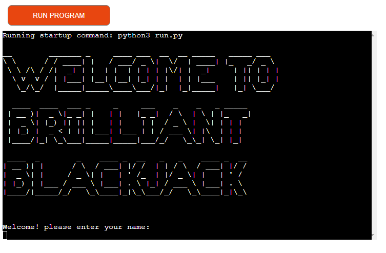

The landing page displays a welcome message to the user and asks them to enter their name before playing.

#### Enter Name

Beneath the welcome message the game asks the user to enter a name, this can be seen in the image above. 

The enter name has validation to stop the user entering a blank name and entering "computer" as a name. An error message is displayed prompting the user to try again. 

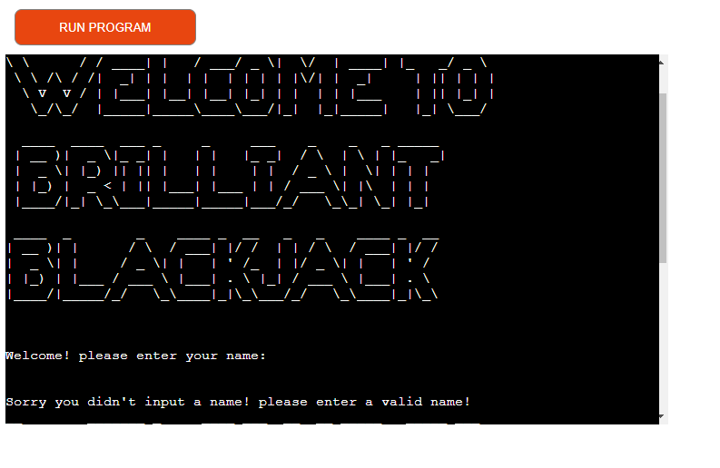

#### Game Rules

Before starting the game, the user has the option to review the game rules or play without.

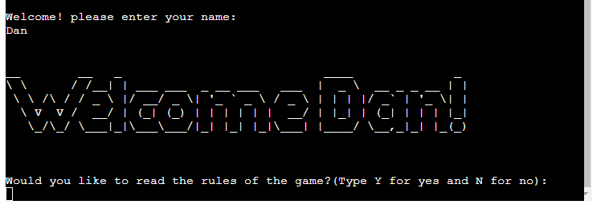

The game rules options have validation to ensure the user only selects "Y" or "N". If the user enters anything other than that, the error message Sorry you can only select Y for (yes) or N for (no), please try again!" 

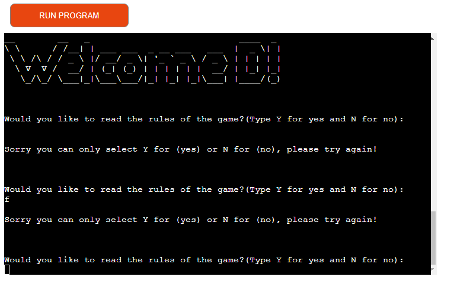

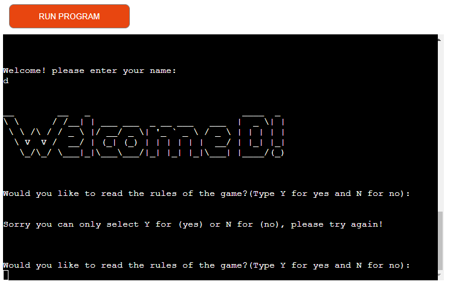

When the user enters the correct input of "Y" a display of the rules is brought up for the user to read.

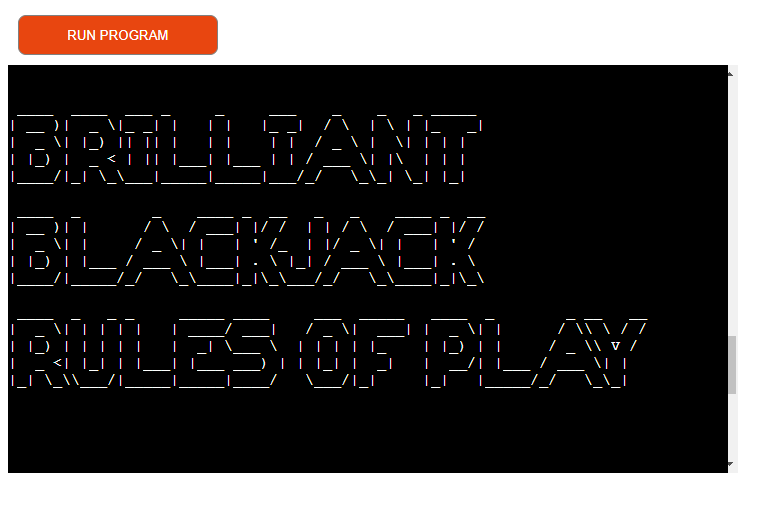

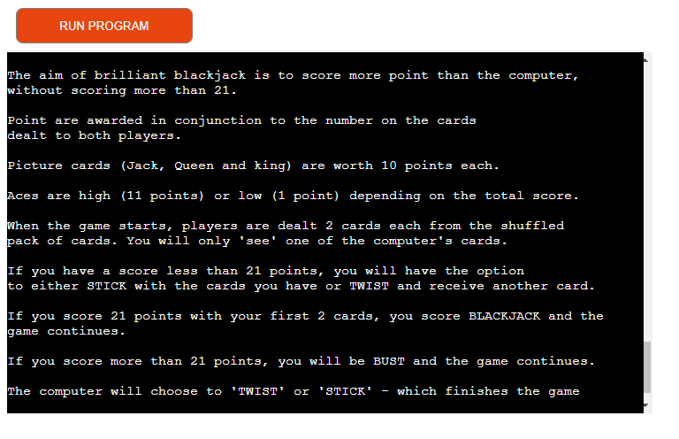

If the user decides not to read the rules the game will begin.

#### Main Game

After the user has selected to start the game, the game will begin to shuffle the deck of cards, and deal out cards to the computer and user. The user will be informed of their cards and score and will be given the option to stick or twist. Again this has validation so the users can only select "S" or "T".

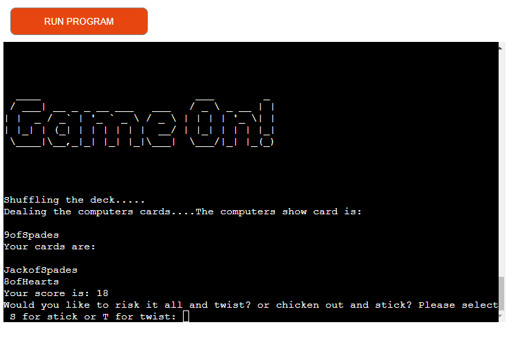

Invalid input error.

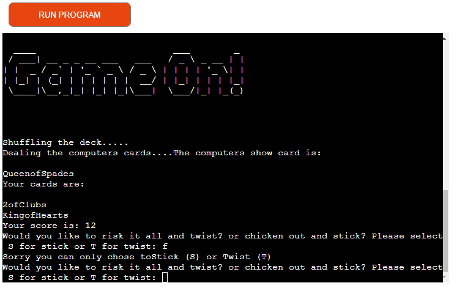

If the user chooses to twist, they will be dealt another card and their score updated, providing the user doesn't bust, the option of stick or twist will be given again. If the user does bust, a message is displayed and a point awarded to the computer.

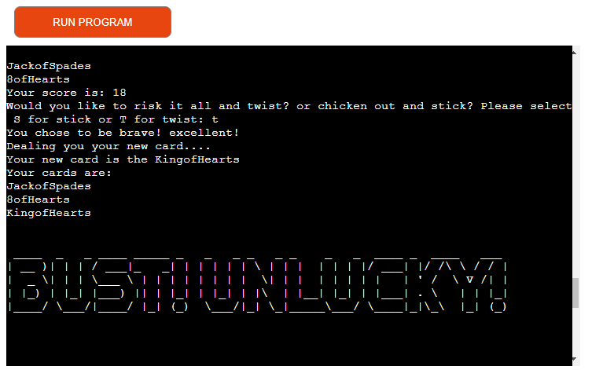
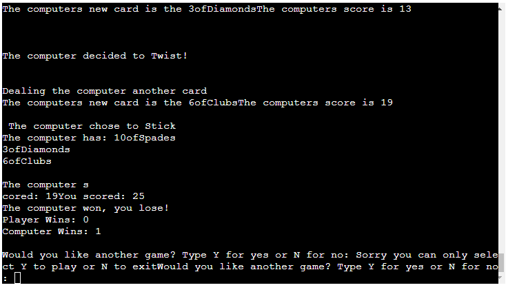

The user will then be asked if the want to play again, if the user selects "Y" the game will restart and total up the games won. If the user select "N" the game will end and display a thankyou for playing message. The inputs also have validation so the user can only choose either "Y" or "N".

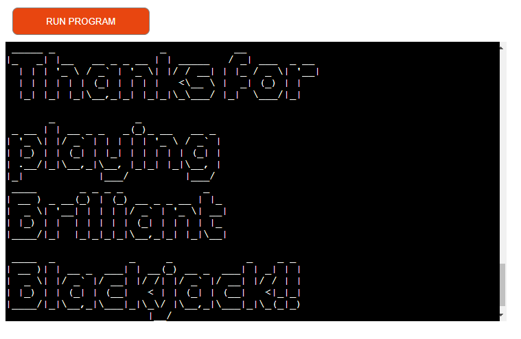

### Features Left to Implement

* Player against player feature.
* Betting with chips whilst playing.

## Technologies Used

* [Python](hhttps://www.python.org/) was used to create the game functionality.
* [Codeanywhere](https://codeanywhere.com/) was used to create, edit and preview the codes.
* [Git](https://git-scm.com/) was used for version control and tracked changes in the codes.
* [GitHub](https://github.com/) was used to store the codes and deploy the website.
* [PEP8CI](https://pep8ci.herokuapp.com/) was used to validate python code.

## Testing

### Code Validation

The website was fully validated using the PEP8CI validator and returned no errors.

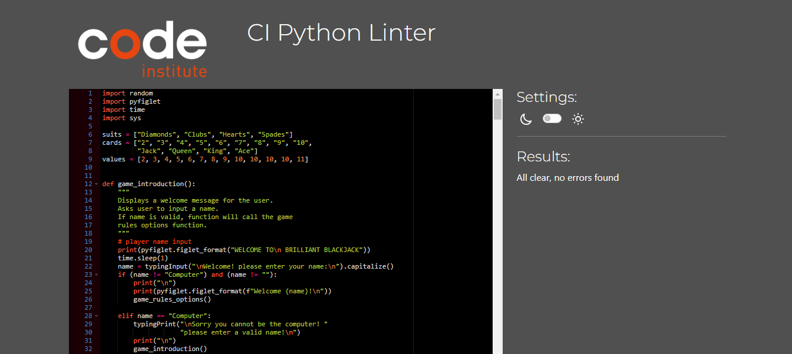

### Resolved Bugs

* Resolved a bug where the read the rules while true loop, was continously looping back after the game had ended. I fixed this by deleting the while True and just leaving the if else statements, i then split the game rules function into two functions. One for the displaying of the rules and the second for the input options for reading the rules. I then called these functions at the appropiate points i.e error messages so the options will be displayed again.

### Unresolved Bug

* There are no unresolved bugs that I am aware of.

#### Manual testing

* All inputs were tested for all eventualities, the tests consisted of not putting a selection/name when prompted to, putting the wrong selection/name when prompted to and putting the correct selections. All inputs that were given wrong/no selections all successfully gave an error message that prompts the user what is required and to try again.

* Both myself and my mentor have been testing the game and have found some minor grammatical errors, these have been fixed and the game runs as it should.

## Deployment

### Version Control

The version control was maintained using git within Codeanywhere to push code to the main repository.

 * From the Codeanywhere terminal type `"git add ."`, to make changes and/or updates to the files.

 * Type `"git commit -m (insert a short descriptive text)"`, which commits the changes and updates the files.

 * Use the `"git push"` command, which pushes the committed changes to the main repository. 

 ### Page Deployment
 The app was deployed to Heroku CLI. The steps to deploy are as follows:

 * After creating an account and logging in, click `"New"` to create a new app from the dashboard.
 * Create a unique name for the app and select my region; press `"Create app"`.
 * Go to `"Settings"` and navigate to `Config Vars`.
 * Add Config Vars. 
   * For this app was only used: `KEY` = `PORT` : `VALUE` = `8000`.
 * Add buildpacks `Python` and `NodeJS` - in this order.
 * Click the `Deploy Branch`.
 * Scroll Down to Deployment Method and select GitHub.
 * Select the repository to be deployed and connect to Heroku.
 * Scroll down to deploy: 
    * `Option 1` is selecting Automatic deploys (Will Update Automatically with every "git push"). This was chosen for this project.

* Live deployment [Brilliant Blackjack](https://brilliant-blackjack-94e6e2e8e263.herokuapp.com/)

## Credits

### Contents

### Codes

* The code used for the typing input and typing print was taken from [101 computing.net](https://www.101computing.net/python-typing-text-effect/)

### Libraries

* Random - has been used to generate random cards for the user and computer, it has also been used to randomly select whether the computer twists or sticks using a range based on total score of cards. The random feature was implemented by researching it on [Python for beginners](https://www.pythonforbeginners.com/random/how-to-use-the-random-module-in-python)

* pyfiglet - Has been used to create a bold decorative text for certain print statements within the project, this adds to the user experience and is visually appealing. The pyfiglet feature was implemented by researching it on [Java T point](https://www.javatpoint.com/python-pyfiglet-module)

* Time - has been used to add a sleep time in certain parts of the project to give the appearance of loading before a statement of input is shown to the user. The Time feature was implemented by researching it on [Python](https://docs.python.org/3/library/time.html)

* Sys - has been used to allow the game to end when the user selects a certain option within the game when prompted to. The Time feature was implemented by researching it on [Python](https://docs.python.org/3/library/sys.html)

## Acknowledgements

This website was created as a portfolio 1 project for the Full Stack Software Development course at [Code Institute](https://codeinstitute.net/ie/). I would like to thank my mentor, [Harry Dhillon](https://github.com/Harry-Leepz), for the guidance and encouragement given throughout the project. Following his valuable feedback and advice, the project has been refined to be more intuitive and it has improved the overall user experience.

I would also like to thank the slack community at Code institute, for help and guidence with some issues I faced.