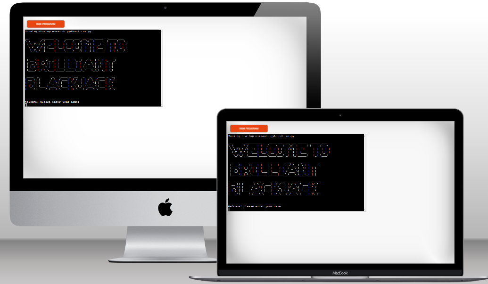

# Brilliant Blackjack

Brilliant Blackjack is a python terminal game, which runs in a mock terminal through Heroku.

Users will play against the computer to get blackjack or as close to it as they dare. Each round will add to a total score bewtween player and computer. The aim of the game is to beat the computer.

## Live Website

[Brilliant Blackjack](https://brilliant-blackjack-94e6e2e8e263.herokuapp.com/)

## Repository

[Repository Link](https://github.com/Daniel009891/brilliant-blackjack)

## UX: User Experience

### User Stories

As a user,

* I would like the website to be visually appealing.
* I would like to be able to navigate easily through the website.
* I would like to test my knowledge with an interactive quiz.
* I would like to be able to recieve feedback on correct and incorrect answers.

### Initial Concept

The initial concept was to create a website that features a simple interactive quiz for the purpose of testing existing electrical knowledge. 

### Website Structure

Bright Spark consists of two HTML pages. The layout of the website is simple and consistent. A start button on the first html page makes it simple and easy for the user to start the quiz.

The second page consists of the Javascript quiz which offers feedback on correct and incorrect answers throughout with the aid of colors to denote these. Green shows a correct answer and red shows an incorrect answer.

The website is fully responsive to different screen sizes and the layout adapts and changes as the screen sizes decrease. This was found to be the best option to keep a clear and concise website. Headings and buttons change size as the screen sizes get smaller, so as to not disform the layout. 

### Imagery

The background image has been chosen to highight the spark element of the title and allows a good contrast for headings and buttons.

### Colour Scheme

The colour scheme for the website is minimilistic to enable all users to read the text without any posibility of clashing with backgrounds. Yellow text contrasts with the blue elements of the background image to allow the text to be read easily. All buttons also take advantage of this, having the same contrasting colours which invert using the hover feature in CSS.

The colour for the headings and general text is Chartreuse hex #dffe00, when text is used on a button the colour is Trapped darkness hex #0c192c with a background of Chartreuse hex #dffe00. A hover feature enables these to invert to create a further contrast and alert the user of a button. 

### Typography

There is only one font used in the website and it is imported from [Google Fonts](https://fonts.google.com/). Shadows Into Light was picked due to its exiting and upbeat feel, this compliments the topic beautifully as electricity and sparks are often represented this way.

## Features

### Existing Features

#### Start button and h1 element

Featured on the first HTML page, the start button allows the user to be linked to the start of the quiz, the h1 element shows the user the name of the website.

#### Start button and h1 for screen sizes <350px

At 350px the heading text will stack in such a way that it will fit the screen nicely but not obstruct the start button. The start button keeps the same distance between the heading and itself. 

#### Start button and h1 for screen sizes >1100px

at 1100px the h1 element and start button will fill the screen area without stacking text on top of each other. The start button will mainitain an equal distance from the heading element to avoid looking cluttered.  

#### The Quiz page

The second HTML page dislays the actual quiz, this consists of a h2 element, a h3 element, 4 answer buttons and a next button. 

##### Greater than 1100px

##### less than 450px

At less than 450px the quiz area is condensed, the answer buttons are made smaller and the heading text is stacked to accomodate the smaller area. The space between the answer buttons is maintained. 

### Features Left to Implement

* I would like to add a countdown timer for each question, this would create a more competetive quiz as users would need to think fast before selecting an answer.

* I would also like to add a create account feature, so users can store their scores against theirr login details.

## Technologies Used

* The website was created with [HTML](https://html.spec.whatwg.org/).
* [CSS](https://www.w3.org/Style/CSS/Overview.en.html) was used to add styling to the website.
* [JavaScript](https://en.wikipedia.org/wiki/JavaScript) was used to create the quiz functionality.
* [Codeanywhere](https://codeanywhere.com/) was used to create, edit and preview the codes.
* [Git](https://git-scm.com/) was used for version control and tracked changes in the codes.
* [GitHub](https://github.com/) was used to store the codes and deploy the website.
* [Chrome Dev Tools](https://developer.chrome.com/docs/devtools/) were used extensively while adjusting the objects in the website for different screen sizes.
* The website was fully validated using [W3C HTML Validator](https://validator.w3.org/) and [W3C CSS Validator](https://jigsaw.w3.org/css-validator/).
* [Am I responsive?](https://ui.dev/amiresponsive) was used to generate the mockup image showing the website on various screen sizes.
* The fonts used in the website are imported from [Google Fonts](https://fonts.google.com/).
* [Shutterstock](https://www.shutterstock.com/) was used to source royalty free images.

## Testing

### Code Validation

The website was fully validated to ensure there were no syntax errors. The official [W3C HTML Validator](https://validator.w3.org/) and [W3C CSS Validator](https://jigsaw.w3.org/css-validator/) were used for the validation and no errors were found. [JSHint](https://jshint.com/) was used to ensure no errors were found within the JavaScript. 15 warnings were detected but these relate to some syntaxes only being available in ES6. 

### Lighthouse

The website was tested with Lighthouse in the Dev Tools for performance, accessibility, best practices, and SEO.

##### Results for index.html for desktop

##### Results for index.html for mobile

##### Results for quiz.html for desktop

##### Results for quiz.html for mobile

### Brower Compatibility

Appearance, functionality and responsiveness of the website were tested with the following browsers:

* Google Chrome
* Safari
* Microsoft Edge

As part of this testing, the following were tested and no issues were found:

* All internal links function as expected.
* All features function as expected.
* Responsiveness to different screen sizes - font sizes, margins, buttons and overall spacing.

The website was also manually tested on iPhone 12 pro, samsung galaxy tab e and HP pavillion laptop for the above. No issues were found.

### Responsiveness

Responsiveness design tests were executed using [Chrome Dev Tools](https://developer.chrome.com/docs/devtools/) and no issues were found. This included the following devices:

* iPhone 4, SE, XR, 12 Pro, 5/SE, 6/7/8, 6/7/8 Plus and X
* iPad Air and iPad Mini
* Samsung Galaxy S8+, S20 Ultra
* Microsoft Surface Pro 7 and Duo
* Nest Hub and Hub Max

### Resolved Bugs

* A bug was fixed where the questions and answers were not displayed in the quiz area, this was found to be a grammatical error in the element id for answer buttons and questions id in the script.js.

### Unresolved Bug

* Unfortunately i cannot get the favicon icon working, so this is an unresolved bug.

## Deployment

The website has been deployed to GitHub pages.
The live link can be found here - [Bright Spark](https://daniel009891.github.io/bright-spark/)

### Deploying a GitHub Repository to GitHub Pages

1. Navigate to the "Settings" tab in the GitHub repository.
2. Select "Pages" from the menu on the left.
3. Under the "Source" section, select "Deploy from a branch" and "Branch: main." Click on "Save."
4. GitHub takes a short while to publish the website. Refresh the page, if not done automatically, and once the website is deployed, the URL will be displayed.  

### Forking the GitHub Repository

To make a copy or "fork" the original repository to view or make changes without affecting the original repository,

1. Log into GitHub and locate the repository.
2. Select the "Fork" option at the top of the screen to create a copy of the repository.
3. This will create a copy of the repository in your GitHub account.

### Creating a Local Clone

1. In the GitHub repository, select the "Code" button.
2. In the "Clone" box, under the "HTTPS" tab, click on the clipboard icon to copy the URL.
3. In Gitpod, change the current working directory to the location you would like the cloned directory to be created.
4. Type "git clone" and then paste the URL copied from GitHub.
5. Press "Enter" and the local clone will be created.

## Credits

### Contents

### Media

* Images used were sourced from [shutterstock.com](https://www.shutterstock.com/).

### Codes

* The question layout and function ideas were inspired by the [stackoverflow.com](https://stackoverflow.com/questions/75996907/trying-to-implement-a-scoring-system-to-a-web-based-trivia-game) forum submission.

* The container method was inspired by [linuxhint.com](https://linuxhint.com/how-to-make-html-container-box-in-html/#b1).

## Acknowledgements

This website was created as a portfolio 1 project for the Full Stack Software Development course at [Code Institute](https://codeinstitute.net/ie/). I would like to thank my mentor, [Harry Dhillon](https://github.com/Harry-Leepz), for the guidance and encouragement given throughout the project. Following his valuable feedback and advice, the website has been refined to be more intuitive and it has improved the overall user experience.

I would also like to thank the slack community at Code institute, the issues with functio